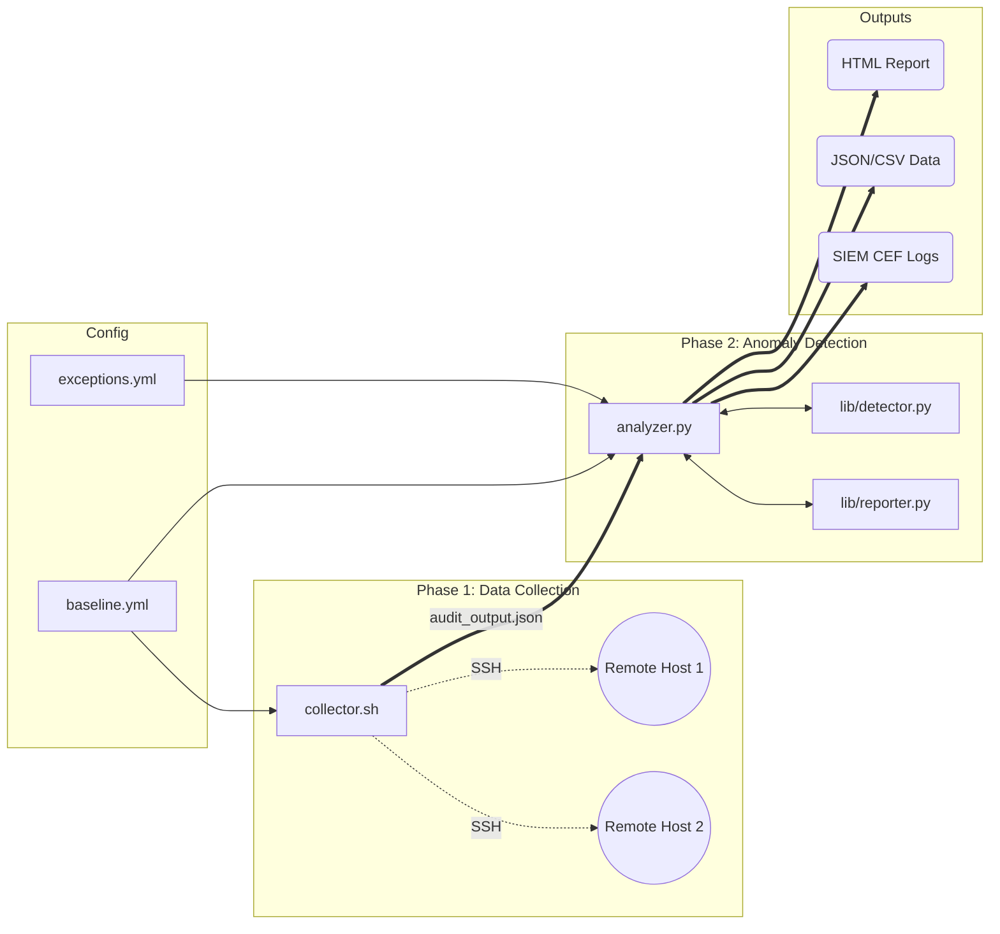

# 🛡️ NetSniffer — Enterprise Network Anomaly Detection Suite (v2.0)

A modular, enterprise-grade network audit framework for IT security professionals. NetSniffer collects network telemetry data locally or across remote hosts via SSH, and applies a rule-based anomaly detection engine to identify DNS policy violations, ARP spoofing, SSL interception, rogue devices, and segmentation failures.

## 🌟 Key Features (v2.0)

- **Agentless Multi-Host Auditing:** Scan 1 or 100 Linux servers simultaneously via SSH.
- **Stealth Asset Discovery:** Highly evasive Layer-2 ARP sweeps (`nmap -sn -PR --randomize-hosts --data-length 16`) to bypass IPS/IDS and locate shadow IT.
- **External YAML Configurations:** No hardcoding. Baseline configurations and exception allowlists are managed centrally.
- **SIEM Integration:** Exports findings natively to JSON, CSV, and CEF (Common Event Format) for ingestion into Splunk, QRadar, or ELK.
- **Professional Reporting:** Generates beautiful, self-contained HTML audit reports with risk scoring and severity badges.

---

## 🏗️ Architecture



---

## 🚀 Quick Start

### 1. Configure your environment
Edit `config/baseline.yml` to define your network segments, authorized devices, and allowed DNS servers.

### 2. Collect Data 
Run the collector. It will automatically read your YAML config and scan any remote hosts defined, as well as the local machine.
```bash
chmod +x collector.sh
sudo ./collector.sh
```
*Note: `sudo` is recommended so the collector can read the full ARP table and execute raw Layer-2 discovery sweeps.*

### 3. Analyze & Generate Reports
```bash
python3 analyzer.py --format html,json,csv,cef
```
This reads the JSON files placed in `outputs/` and matches them against your baseline, generating final reports.

### 4. View the Report
```bash
python3 -m http.server --directory outputs 8080
# Or simply open outputs/audit_report.html in any browser
```

---

## 🔍 Detection Rules (11 Checks)

NetSniffer runs 11 active checks against the collected telemetry telemetry.

| # | Rule | Severity | Description |
|---|------|----------|-------------|
| 1 | **Blocked Domain Resolution** | CRITICAL | Identifies if explicitly blocked domains bypass DNS filtering policies. |
| 2 | **Unknown SSL CA** | CRITICAL | Detects certificates not issued by a public CA (indicates MITM or Deep Packet Inspection). |
| 3 | **Gateway MAC Mismatch** | CRITICAL | Flags unexpected default gateway MACs (classic ARP spoofing indicator). |
| 4 | **Certificate Expiry Check** | CRITICAL/HIGH | Warns on expired or soon-to-expire SSL/TLS certificates. |
| 5 | **Rogue Device Detection** | HIGH | Flags active IPs/MACs on local subnets not listed in `authorized_devices`. |
| 6 | **Cross-Segment ARP** | HIGH | Detects MAC/IP leaks between theoretically isolated VLAN segments. |
| 7 | **DNS Timeout** | HIGH/MEDIUM | Alerts when the primary corporate DNS server is unreachable. |
| 8 | **DNS Configuration Audit** | HIGH/MEDIUM | Detects unauthorized or rogue DNS servers mapped in `resolv.conf`. |
| 9 | **Duplicate IPs** | HIGH | Identifies IP conflicts or ongoing ARP poisoning attacks. |
| 10 | **Open Port Analysis** | HIGH/MEDIUM | Flags explicitly sensitive open ports (SMB, RDP, VNC, MySQL, FTP). |
| 11 | **Traceroute Latency Spike** | MEDIUM | Detects >100ms latency jumps between hops (potential routing hijacks or congested links). |

---

## ⚙️ Configuration Guide

### The Baseline (`config/baseline.yml`)
Define the "known-good" state of your network.
```yaml
network:
  segments:
    - 10.0.1.0/24
    - 10.0.2.0/24

authorized_devices:
  - "10.0.1.50"
  - "10.0.1.1"

dns:
  servers:
    - "8.8.8.8"
    - "1.1.1.1"
```

### Exceptions (`config/exceptions.yml`)
To suppress false positives (like an expected corporate SSL inspection proxy), add an exception:
```yaml
exceptions:
  - rule: ssl_unknown_ca
    match: "CorporateProxy-CA"
    reason: "Internal DPI appliance"
```

---

## 🛠️ Requirements

**Collection Target (Linux)** 
- Bash 4+
- `iproute2`, `dnsutils` (`dig`/`nslookup`), `whois`, `openssl`
- `nmap` (Optimal for stealth subnet discovery)

**Analyzer (Any OS)**
- Python 3.10+
- `PyYAML` (Install via `pip install -r requirements.txt`)

---

## 🛡️ Privacy & OpSec
- `outputs/` and `*.csv` are heavily git-ignored to prevent accidental leaks of internal `.json` audit data or firewall policy exports. 
- Ensure your `baseline.yml` is sanitized with generic placeholders before pushing to public repositories.

*Built for authorized IT Security & Auditing purposes only.*
